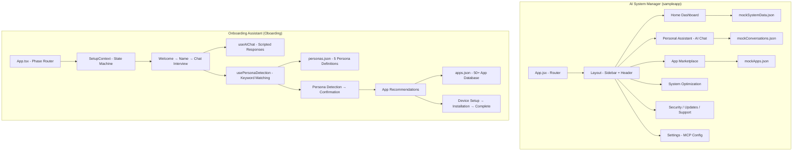

# Codebase Analysis — Brainstorming Repo

> A mentor-style walkthrough of the two sample apps in this repository.
> Written for developers who are new to the codebase and want to understand how everything fits together before diving into code.

---

## 1. The "10,000-Foot View" (Architecture)

The `Andy/` folder contains **two restaurant prototypes**:

- **AI System Manager** (`sampleapp/`) — The full dining experience. A Windows-style system management dashboard with 8 pages: home dashboard, AI personal assistant, app marketplace, system optimization, security, device updates, support, and settings. Think of it as a mock "HP Support Assistant meets Copilot."

- **Onboarding Assistant** (`Oboarding/`) — The host stand that greets you and learns your preferences. A guided 14-phase setup wizard that chats with users, detects their persona (Gamer, Student, Professional, Creator, Casual), recommends apps, configures devices, and installs everything.

**Both are front-end only** — a dining room with no kitchen. All data is pre-made (mock JSON files). There's no backend, no database, no real AI. The "brain" is scripted responses and keyword matching.

### How They Connect

They don't — yet. These are independent prototypes that could eventually become parts of a single product (onboarding flow → main dashboard).



---

## 2. The "Building Blocks" (Folders & Tech)

### Primary Language

**JavaScript** (System Manager) and **TypeScript** (Onboarding Assistant), both using **React**.

### Top 3 Helpers

| Helper | Role | Analogy |
|--------|------|---------|
| **Vite** | Build tool & dev server | The construction crew — fast builds, hot reload |
| **Tailwind CSS** | Utility-first CSS framework | The interior designer — consistent styling via class names |
| **Lucide React** | Icon library | The sign maker — all the UI icons |

Additional tools: `react-router-dom` (navigation), `framer-motion` (animations, Oboarding only), `react-markdown` (markdown rendering, System Manager assistant).

### Folder Map: System Manager (`Andy/sampleapp/`)

```
src/
├── App.jsx              ← "Table of contents" — defines all 8 routes
├── main.jsx             ← Entry point, renders App
├── context/
│   └── AppContext.jsx   ← "The manager's clipboard" — theme, sidebar, user state
├── pages/               ← "The different rooms" — one per route
│   ├── Home.jsx         ← Dashboard with PC health, actions, performance
│   ├── PersonalAssistantNew.jsx  ← AI chat (708 lines, the biggest file)
│   ├── AppMarketplace.jsx        ← Browse/install apps
│   ├── SystemOptimization.jsx    ← Performance tuning
│   ├── Security.jsx     ← Security status
│   ├── DeviceUpdates.jsx← Update management
│   ├── Support.jsx      ← Help center
│   └── Settings.jsx     ← MCP server config, permissions, memory
├── components/
│   ├── common/          ← "Reusable furniture" — Button, Card, Modal, Badge, etc.
│   ├── home/            ← Dashboard widgets (PCHealthCard, AskPCAI, etc.)
│   └── layout/          ← Shell components (Sidebar, Header, Layout)
├── data/                ← "Pre-made food" — all mock JSON data
│   ├── mockSystemData.json
│   ├── mockApps.json
│   ├── mockConversations.json
│   ├── mockUpdates.json
│   ├── mockMemory.json
│   └── mockAssistants.json
└── styles/              ← Global CSS + markdown styling
```

### Folder Map: Onboarding Assistant (`Andy/Oboarding/`)

```
src/
├── App.tsx              ← "Phase router" — switch statement over 14 phases
├── main.tsx             ← Entry point
├── contexts/
│   └── SetupContext.tsx ← "The state machine" — 16 actions, all phase transitions
├── hooks/               ← "The brains" — business logic
│   ├── useAIChat.ts     ← Chat simulation + suggestion engine
│   ├── usePersonaDetection.ts  ← Keyword-matching persona detector
│   ├── useBackgroundTasks.ts   ← Simulated background task runner
│   └── useInstallationSimulator.ts ← Fake app install progress
├── components/
│   ├── welcome/         ← Landing screen
│   ├── interview/       ← Chat interface, name input, analyzing screen
│   ├── persona/         ← Detection, confirmation, app recommendations
│   ├── setup/           ← Device detection, displays, Bluetooth, peripherals
│   ├── progress/        ← Installation progress, progress bars
│   ├── completion/      ← Setup complete celebration
│   ├── activity/        ← Background task activity panel
│   └── shared/          ← Reusable components (Button, Card, Modal)
├── types/               ← TypeScript type definitions
│   ├── setup.ts         ← SetupPhase, SetupState, Message, etc.
│   ├── personas.ts      ← PersonaType, PersonaDetectionResult
│   └── apps.ts          ← App, AppCategory, AppInstallation
├── data/                ← "Pre-made food"
│   ├── personas.json    ← 5 persona definitions with keywords
│   ├── apps.json        ← 50+ apps with persona mappings
│   └── conversationFlows.json ← Scripted conversation templates
└── utils/
    ├── appRecommender.ts ← Filters apps by persona match
    └── mockData.ts       ← Device/peripheral mock generators
```

---

## 3. The "AI Brain"

### System Manager: Mock AI

The AI chat interface lives in `PersonalAssistantNew.jsx` (708 lines). It has:
- A conversation sidebar with pinned/unpinned chats
- A canvas panel for rendering markdown/code
- File attachment UI
- Quick recommendation tiles

**But the "brain" is pre-scripted.** The `handleSendMessage` function generates canned responses based on keywords in the user's input. There is no API call to any LLM. The responses look intelligent because they're well-written templates.

The **Settings page** has MCP server configuration UI (add/remove servers with URLs), permissions toggles, and an AI memory management section — all mock/local state. These hint at future real AI integration.

### Onboarding: Keyword-Based Persona Detection

The Onboarding app has a more structured "brain" in two hooks:

**`useAIChat.ts`** — Generates responses based on conversation stage:
1. First message → extracts user's name
2. Second message → detects broad use case (gaming, work, school, creative, general)
3. Third message → wraps up and triggers persona analysis

**`usePersonaDetection.ts`** — The actual detection algorithm:
1. Combines all user messages into one string
2. For each of the 5 personas, counts how many of its keywords appear in the text
3. Calculates confidence as `(matched / total) × 100 × 3` (boosted for UX)
4. Picks the highest-confidence match (defaults to "Professional" if none >10%)
5. Flags as "hybrid" if the second-highest persona has >30% confidence

This is a simple bag-of-words classifier — no ML, no embeddings. It works well for demos because the keywords are carefully chosen.

---

## 4. How to Read It

### Start Here

- **System Manager:** `Andy/sampleapp/src/App.jsx` — 8 routes, one per page
- **Onboarding:** `Andy/Oboarding/src/App.tsx` — 14 phases in a switch statement

### Action Trace: System Manager

> User clicks "Optimize My PC" on the dashboard

```
Home.jsx
  └── PCHealthCard.jsx (renders health score from mockSystemData.json)
        └── "Optimize My PC" button → setShowOptimizeModal(true)
              └── Modal opens → handleOptimize() → 3-second timer
                    └── Close modal, or navigate('/system-optimization')
```

The whole app uses **React Router** for navigation and **localStorage** for theme persistence. State is lifted via `AppContext.jsx` (theme, sidebar, user).

### Action Trace: Onboarding

> User goes through the setup flow

```
App.tsx renders based on state.currentPhase:

welcome → WelcomeScreen.tsx (click "Get Started")
  └── dispatch SET_PHASE → 'name-input'

name-input → NameInputScreen.tsx (type name, click Continue)
  └── dispatch SET_USER_NAME, SET_PHASE → 'interview'

interview → ChatInterface.tsx (3+ messages)
  └── useAIChat.ts processes each message
  └── After 3 user messages → dispatch SET_PHASE → 'analyzing'

analyzing → AnalyzingScreen.tsx (2-second animation)
  └── usePersonaDetection.ts runs detectPersona()
  └── dispatch SET_PERSONA, SET_PHASE → 'persona-detection'

persona-detection → PersonaDetection.tsx (animated reveal)
  └── dispatch SET_PHASE → 'persona-confirmation'

persona-confirmation → PersonaConfirmation.tsx (accept or re-interview)
  └── dispatch SET_PHASE → 'app-recommendations'

app-recommendations → AppRecommendations.tsx
  └── appRecommender.ts filters apps by persona
  └── User selects apps → dispatch TOGGLE_APP
  └── Continue → SET_PHASE → 'device-detection'

device-detection → display-arrangement → display-calibration
  → bluetooth-pairing → peripheral-setup
  (each advances via SET_PHASE)

installation → InstallationProgress.tsx
  └── useInstallationSimulator.ts fakes download/install progress
  └── All complete → SET_PHASE → 'complete'

complete → SetupComplete.tsx (celebration screen)
```

---

## 5. Red Flags & Security

| Item | Status | Notes |
|------|--------|-------|
| Hardcoded secrets | None found | All API keys/tokens are absent (no real APIs used) |
| tmpclaude-* temp files | Cleaned up | Were present, now removed via .gitignore + manual cleanup |
| Authentication | None | Expected for prototypes — no user auth system |
| Input sanitization | Missing | MCP server URLs in Settings page accept any input — flag for POC |
| XSS risk | Low | React handles escaping by default; markdown rendering uses `react-markdown` |
| Dependencies | Some deprecated | `eslint@8`, `inflight`, `glob@7` — no security-critical issues |

### The #1 Thing Not to Break

**`SetupContext.tsx`** in the Onboarding app. This is the state machine that controls the entire 14-phase flow. It manages:
- Phase transitions (16 action types)
- User data (name, persona, selected apps)
- Task progress (active/completed tasks)
- Session persistence (localStorage auto-save)

If this file breaks, the entire Onboarding flow breaks. Treat it as the spine of the app.

---

## Deep Dives

- **[AI System Manager →](sampleapp.md)** — Component hierarchy, page-by-page features, data flow, styling
- **[Onboarding Assistant →](oboarding.md)** — Phase flow diagram, persona detection algorithm, app recommender, hooks
