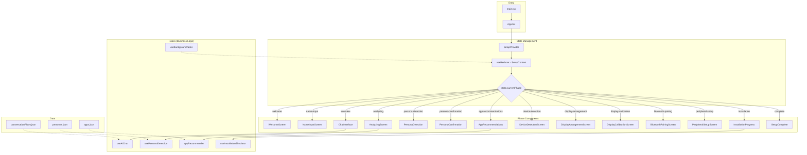
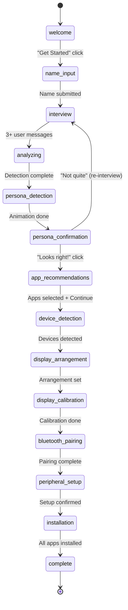
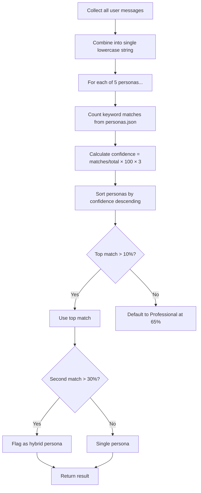

# Deep Dive: Onboarding Assistant (`Andy/Oboarding/`)

> A comprehensive analysis of the Onboarding Assistant prototype — phase flow, persona detection, app recommendations, and architecture.

---

## Architecture Overview



---

## Phase Flow

The app is a linear state machine with 14 phases. Each phase renders one full-screen component.



### Phase Details

| # | Phase | Component | What Happens |
|---|-------|-----------|--------------|
| 1 | `welcome` | `WelcomeScreen` | Landing page with "Get Started" button |
| 2 | `name-input` | `NameInputScreen` | User types their name |
| 3 | `interview` | `ChatInterface` | 3-message conversational interview |
| 4 | `analyzing` | `AnalyzingScreen` | 2-second animated analysis screen |
| 5 | `persona-detection` | `PersonaDetection` | Animated persona reveal |
| 6 | `persona-confirmation` | `PersonaConfirmation` | User confirms or rejects persona |
| 7 | `app-recommendations` | `AppRecommendations` | Persona-filtered app selection grid |
| 8 | `device-detection` | `DeviceDetectionScreen` | Simulated hardware scan |
| 9 | `display-arrangement` | `DisplayArrangementScreen` | Multi-monitor layout |
| 10 | `display-calibration` | `DisplayCalibrationScreen` | Display settings adjustment |
| 11 | `bluetooth-pairing` | `BluetoothPairingScreen` | Bluetooth device pairing |
| 12 | `peripheral-setup` | `PeripheralSetupScreen` | Keyboard, mouse, webcam setup |
| 13 | `installation` | `InstallationProgress` | Animated app install progress |
| 14 | `complete` | `SetupComplete` | Celebration screen |

---

## The State Machine (`SetupContext.tsx`)

Central to the entire app. Uses `useReducer` with 16 action types:

| Action | Payload | Effect |
|--------|---------|--------|
| `SET_PHASE` | `SetupPhase` | Transitions to a new phase |
| `ADD_MESSAGE` | `Message` | Appends a chat message |
| `SET_USER_NAME` | `string` | Stores the user's name |
| `SET_PERSONA` | `PersonaDetectionResult` | Sets detected persona |
| `SET_SELECTED_APPS` | `App[]` | Replaces selected app list |
| `TOGGLE_APP` | `App` | Adds/removes an app from selection |
| `SET_MIGRATION_METHOD` | `MigrationMethod` | Sets migration preference |
| `SET_MONITORS` | `Monitor[]` | Sets detected monitors |
| `SET_PERIPHERALS` | `Peripheral[]` | Sets detected peripherals |
| `UPDATE_PROGRESS` | `number` | Updates overall setup progress % |
| `ADD_TASK` | `TaskStatus` | Adds a background task (deduped by ID) |
| `UPDATE_TASK_PROGRESS` | `{id, progress, ...}` | Updates task progress |
| `COMPLETE_TASK` | `string` (id) | Moves task from active to completed |
| `FAIL_TASK` | `{id, error}` | Marks task as errored |
| `LOAD_SESSION` | `SetupState` | Restores from localStorage |
| `RESET_SETUP` | — | Resets to initial state |

**Session Persistence:** Auto-saves to localStorage every 30 seconds. Restores on page reload with date object reconstruction.

### State Shape

```typescript
interface SetupState {
  currentPhase: SetupPhase;       // Which screen to show
  messages: Message[];            // Chat history
  userName: string | null;        // From name-input phase
  detectedPersona: PersonaDetectionResult | null;
  selectedApps: App[];            // User's chosen apps
  migrationMethod: MigrationMethod | null;
  monitors: Monitor[];            // Detected displays
  peripherals: Peripheral[];      // Detected devices
  setupProgress: number;          // 0-100
  activeTasks: TaskStatus[];      // Running background tasks
  completedTasks: TaskStatus[];   // Finished tasks
  sessionId: string;              // UUID per session
  startTime: Date;
}
```

---

## Persona Detection Algorithm

Located in `usePersonaDetection.ts`. This is the core "AI" of the app.

### How It Works



### The 5 Personas

| Persona | Sample Keywords | Icon |
|---------|----------------|------|
| **Gamer** | gaming, FPS, streaming, discord, steam, competitive | Gamepad2 |
| **Student** | school, college, research, homework, study, learning | GraduationCap |
| **Professional** | work, office, productivity, spreadsheets, meetings | Briefcase |
| **Creator** | video editing, graphic design, music production, youtube | Palette |
| **Casual** | email, web browsing, photos, shopping, family | Home |

### Confidence Calculation

```
raw_confidence = (matched_keywords / total_keywords) × 100
boosted_confidence = min(100, raw_confidence × 3)
```

The `× 3` multiplier means a user only needs to match ~33% of a persona's keywords to hit 100% confidence. This makes detection feel responsive even with brief conversations.

### Example

User says: "I love gaming and streaming on Twitch"
- **Gamer:** "gaming" + "streaming" = 2/12 keywords → raw 16.7% → boosted 50%
- **Creator:** "streaming" = 1/12 keywords → raw 8.3% → boosted 25%
- Others: 0%
- Result: Gamer at 50%, not hybrid (Creator < 30%)

---

## App Recommendation Engine

Located in `appRecommender.ts`. Three exported functions:

### `getRecommendedApps(primaryPersona, secondaryPersona?)`

1. Filters `apps.json` (50+ apps) to those whose `personas[]` array includes the primary or secondary persona
2. If hybrid: sorts apps that match both personas to the top
3. Returns the filtered/sorted list

### `getEssentialApps()`

Returns hardcoded "universal" apps: Chrome, Firefox, VLC, 7-Zip.

### `getCategoryApps(category)`

Filters apps by category string (Gaming, Productivity, Creative, etc.).

### App Data Structure

Each app in `apps.json`:
```json
{
  "id": "steam",
  "name": "Steam",
  "description": "Gaming platform with thousands of games",
  "icon": "Gamepad",
  "category": "Gaming",
  "personas": ["Gamer"],
  "size": "1.5 GB",
  "installTime": 180,
  "publisher": "Valve Corporation",
  "rating": 4.8
}
```

---

## Hook Descriptions

### `useAIChat` — Chat Simulation

**Purpose:** Manages the conversational interview flow.

**Response Generation Strategy:**
1. **Message 1** (name): Extracts first word as name, greets user, asks about use case
2. **Message 2** (use case): Pattern-matches keywords to generate tailored follow-up:
   - Gaming keywords → asks about game types
   - Work keywords → asks about tools
   - School keywords → asks about needs
   - Creative keywords → asks about content type
   - Default → asks about regular activities
3. **Message 3+**: Wraps up with "I have everything I need" → triggers analysis

**Suggestion Engine:** Returns quick-reply pills based on message count:
- After message 1: `['Gaming', 'Work & Productivity', 'School & Learning', ...]`
- After message 2: `['Video Editing', 'Programming', 'Office Suite', ...]`
- After message 3+: `[]` (no more suggestions)

Also dispatches `UPDATE_TASK_PROGRESS` for the interview task progress bar.

### `usePersonaDetection` — Persona Detector

See [Persona Detection Algorithm](#persona-detection-algorithm) above. Returns `{ isDetecting, detectPersona }`.

### `useBackgroundTasks` — Task Simulation

Manages simulated background tasks (driver updates, system scans, etc.) that appear in the activity panel. Uses `setInterval` to increment progress on active tasks.

### `useInstallationSimulator` — Install Progress

Simulates downloading and installing selected apps during the installation phase. Each app progresses through download → install stages with randomized timing.

---

## Component Hierarchy

```
App.tsx
└── SetupProvider (context: state + dispatch)
    └── SetupFlow
        ├── SetupProgressBar (shows on most phases)
        ├── [Phase Component] (one of 14, based on currentPhase)
        │   ├── WelcomeScreen
        │   ├── NameInputScreen
        │   ├── ChatInterface
        │   │   ├── MessageBubble (per message)
        │   │   ├── TypingIndicator
        │   │   └── QuickReplyPills
        │   ├── AnalyzingScreen
        │   ├── PersonaDetection (animated reveal)
        │   ├── PersonaConfirmation
        │   ├── AppRecommendations
        │   │   └── AppCard (per recommended app)
        │   ├── DeviceDetectionScreen
        │   ├── DisplayArrangementScreen
        │   ├── DisplayCalibrationScreen
        │   ├── BluetoothPairingScreen
        │   ├── PeripheralSetupScreen
        │   ├── InstallationProgress
        │   │   └── TaskStatusItem (per installing app)
        │   └── SetupComplete
        └── ActivityButton (floating, opens ActivityView)
            └── ActivityView (task list panel)
```

### Shared Components

| Component | Purpose |
|-----------|---------|
| `Button` | Animated button with variants (default, elevated, outlined) using framer-motion |
| `Card` | Animated container with hover effects |
| `Modal` | Overlay dialog |
| `ProgressBar` | Horizontal progress indicator |
| `StatusPanel` | Status display card |
| `RightSidebarStatus` | Side panel for status info |

---

## Strengths

1. **Well-structured state machine** — `SetupContext.tsx` clearly defines all phases and transitions
2. **Type safety** — TypeScript throughout with proper interfaces for all data
3. **Smooth animations** — framer-motion adds polish to transitions
4. **Persona system** — The keyword-matching approach is simple but effective for demos
5. **Rich app database** — 50+ apps with persona mappings, sizes, and install times
6. **Session persistence** — Auto-saves to localStorage, survives page refresh
7. **Background task system** — Realistic-feeling progress indicators
8. **Modular hooks** — Business logic cleanly separated from UI components

## Gaps

1. **No real AI** — Chat responses are templated, persona detection is keyword matching
2. **No backend** — Everything is client-side; can't persist across devices
3. **No tests** — Zero test files
4. **Some TypeScript errors** — Unused imports, minor type mismatches (fixed during build verification)
5. **Hardcoded phase order** — No way to skip phases or go back (except persona rejection)
6. **No error recovery** — If a phase component crashes, the whole app breaks
7. **No accessibility** — Missing ARIA labels, keyboard navigation incomplete
8. **Mock device detection** — Displays, Bluetooth, peripherals are all simulated
9. **framer-motion type conflicts** — `MotionProps` incompatibility with React HTML props in Button/Card
