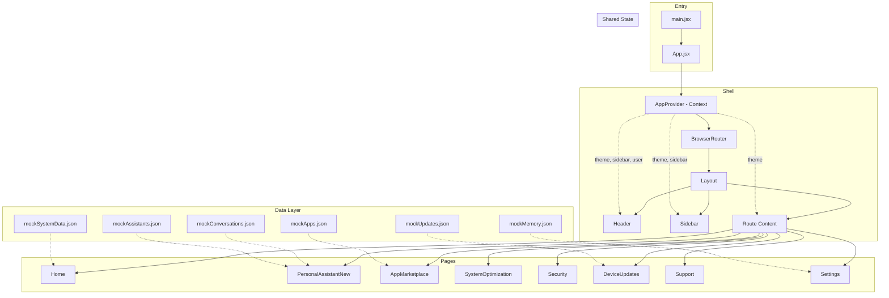
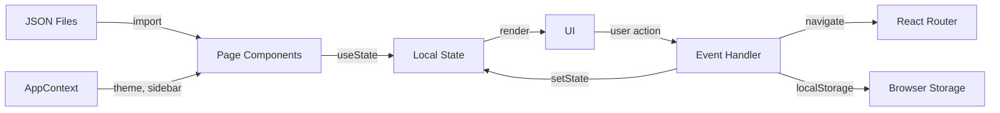

# Deep Dive: AI System Manager (`Andy/sampleapp/`)

> A comprehensive analysis of the System Manager prototype — architecture, components, data flow, and gaps.

---

## Architecture Overview



---

## Component Hierarchy

```
App.jsx
├── AppProvider (context: theme, sidebar, user)
│   └── BrowserRouter
│       └── Layout
│           ├── Sidebar (8 nav items, collapsible)
│           ├── Header (theme toggle, user info)
│           └── Routes
│               ├── / → Home
│               │   ├── PCHealthCard (health score, issues, optimize button)
│               │   ├── ActionsRecommendations (action tiles)
│               │   ├── AskPCAI (quick AI query input)
│               │   ├── PerformanceMode (mode selector)
│               │   ├── DeviceEssentials (storage, RAM, battery)
│               │   └── RecentActivity (activity log)
│               ├── /assistant → PersonalAssistantNew
│               │   ├── Conversation Sidebar (list/table view, pin, delete)
│               │   ├── Chat Area (messages, typing indicator)
│               │   ├── Recommendation Tiles (5 quick actions)
│               │   ├── Input Bar (text, file attach, voice)
│               │   └── Canvas Panel (markdown/code preview + edit)
│               ├── /marketplace → AppMarketplace
│               ├── /system-optimization → SystemOptimization
│               ├── /security → Security
│               ├── /device-updates → DeviceUpdates
│               ├── /support → Support
│               └── /settings → Settings
│                   ├── App Info section
│                   ├── MCP Servers (add/remove/toggle)
│                   ├── Permissions toggles
│                   └── AI Memory management
```

---

## Page-by-Page Feature Inventory

### Home (`Home.jsx`)

| Feature | Component | Data Source |
|---------|-----------|-------------|
| PC Health Score | `PCHealthCard` | `mockSystemData.json → pcHealth` |
| Health Issues List | `PCHealthCard` | `pcHealth.issues[]` |
| Optimize Button + Modal | `PCHealthCard` | Local state, 3s timer |
| Action Tiles | `ActionsRecommendations` | Hardcoded array |
| Quick AI Query | `AskPCAI` | Navigates to `/assistant` with query |
| Performance Mode | `PerformanceMode` | Local state toggle |
| Device Essentials | `DeviceEssentials` | `mockSystemData.json` |
| Recent Activity | `RecentActivity` | `mockSystemData.json` |

### Personal Assistant (`PersonalAssistantNew.jsx` — 708 lines)

The largest and most complex component. Features:
- **Conversation management:** Multiple conversations with pin/delete, list and table views
- **Chat interface:** Message bubbles with timestamps, typing indicator, auto-scroll
- **Canvas panel:** Side panel for rendering markdown, code, or documents with version history
- **File attachments:** Upload UI (mock — no actual upload)
- **Recommendation tiles:** 5 quick-action cards (exam questions, transcribe, resume, logo, debug)
- **Keyboard shortcuts:** Enter to send

**AI Response Logic:** Pattern-matches user input against keywords:
- "optimize" / "performance" → system optimization advice
- "canvas" / "document" / "code" → opens canvas with sample content
- Default → generic helpful response

### App Marketplace (`AppMarketplace.jsx`)

- Grid of app cards with install/uninstall buttons
- Category filter tabs
- Search functionality
- Data from `mockApps.json`

### System Optimization (`SystemOptimization.jsx`)

- Performance metrics display
- Optimization recommendations
- One-click optimization actions
- Before/after comparisons

### Security (`Security.jsx`)

- Security score
- Threat detection status
- Firewall settings
- Recent security events

### Device Updates (`DeviceUpdates.jsx`)

- Available updates list
- Update history
- Auto-update toggles
- Data from `mockUpdates.json`

### Support (`Support.jsx`)

- FAQ section
- Contact options
- Troubleshooting guides

### Settings (`Settings.jsx`)

- **Application Info:** Version, build info
- **MCP Server Configuration:** Add/remove/connect servers with name and URL
- **Permissions:** Desktop access, filesystem access, network access toggles
- **AI Memory:** View/delete stored memory items with categories

---

## State Management

### Global State (`AppContext.jsx`)

Simple React Context with `useState`:

| State | Type | Purpose |
|-------|------|---------|
| `sidebarCollapsed` | `boolean` | Sidebar toggle |
| `theme` | `'light' \| 'dark'` | Theme preference, persisted to localStorage |
| `user` | `object` | Hardcoded demo user `{ name, email, avatar }` |

Exposed functions: `toggleSidebar()`, `toggleTheme()`

### Page-Level State

Each page manages its own state with `useState`. No Redux, no Zustand, no shared state beyond the context. This is fine for a prototype but would need rethinking for a real app.

**Notable:** The Personal Assistant page has ~15 state variables in a single component (conversations, activeConversation, messages, input, isTyping, canvas state, etc.). This is the biggest refactoring candidate.

---

## Data Flow



Key observations:
- **No API calls** — all data is imported directly from JSON files
- **No state library** — just React Context + useState
- **localStorage** used only for theme persistence
- **React Router** handles navigation between pages
- **No caching, no loading states** (because all data is synchronous imports)

---

## Styling & Theming

- **Tailwind CSS** with custom `primary` color scale
- **Dark mode** via Tailwind's `dark:` prefix, toggled by `AppContext`
- **Consistent spacing:** `space-y-6` for page sections, `gap-3` / `gap-6` for grids
- **Responsive:** `grid-cols-1 lg:grid-cols-3` patterns for dashboard widgets
- Custom components wrap Tailwind: `Button`, `Card`, `Badge`, `Modal`, `Tooltip`, `ProgressBar`

---

## Strengths

1. **Clean routing structure** — `App.jsx` is a clear table of contents
2. **Consistent component library** — Shared `Button`, `Card`, `Modal` with variant props
3. **Rich UI** — The personal assistant with canvas, the marketplace, the health dashboard all look polished
4. **Dark mode** works throughout
5. **Good mock data** — Realistic enough to demo effectively

## Gaps

1. **PersonalAssistantNew.jsx at 708 lines** — Should be split into sub-components (ConversationSidebar, ChatArea, CanvasPanel, RecommendationTiles)
2. **No AI integration** — All responses are hardcoded templates
3. **No input validation** — MCP server URLs, chat input, etc. accept anything
4. **No error boundaries** — App would crash on unexpected errors
5. **No loading states** — Everything loads instantly because it's mock data; real APIs would need loading/error UI
6. **No tests** — Zero test files
7. **Large bundle** — 620 KB JS output; would benefit from code splitting
8. **Hardcoded user** — `{ name: 'Demo User' }` in AppContext
