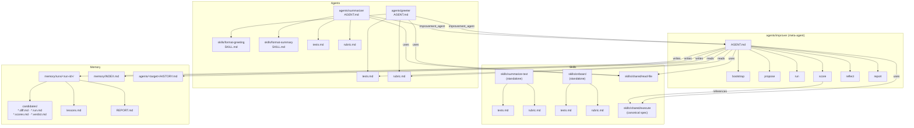
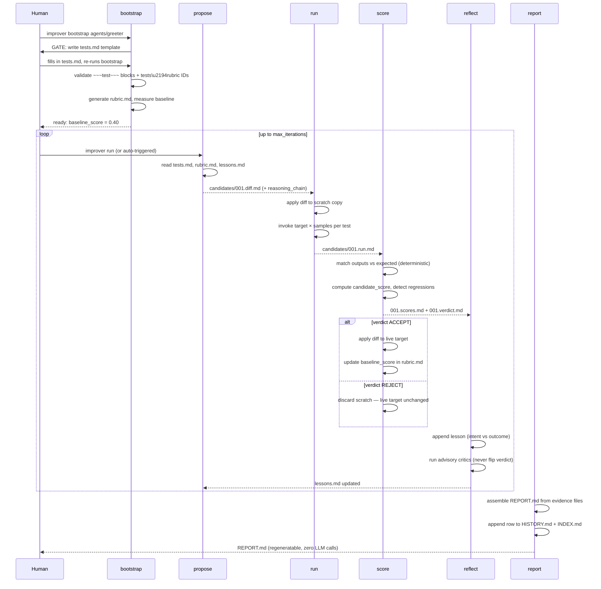

# brainstorming — agent + skills scaffold

A scaffold for building, running, and self-improving LLM agents using nothing
but markdown files with YAML frontmatter. An LLM agent (e.g. Claude Code) reads
`AGENT.md` / `SKILL.md` files and executes the described behavior directly —
there is no runtime code.

---

## Architecture overview



---


## The three skill archetypes

| # | Archetype | Example | Path |
|---|---|---|---|
| 1 | Agent with a **dedicated** skill | `greeter` + `format-greeting` | [`agents/greeter/`](./agents/greeter/AGENT.md) |
| 1b | Agent with **shared skill reuse** | `summarizer` + `format-summary` + `read-file` | [`agents/summarizer/`](./agents/summarizer/AGENT.md) |
| 2 | **Standalone** skill (no owning agent) | `summarize-text`, `onboard` | [`skills/summarize-text/`](./skills/summarize-text/SKILL.md) |
| 3 | **Common shared** skill (any agent) | `read-file`, `execute` | [`skills/shared/read-file/`](./skills/shared/read-file/SKILL.md) |

Rules in one paragraph:

- **Dedicated** skills live *inside* their owning agent at
  `agents/<agent>/skills/<skill>/` and are referenced by that agent only.
- **Standalone** skills live at `skills/<skill>/`, are invoked directly,
  and ship their own `tests.md` + `rubric.md`.
- **Shared** skills live at `skills/shared/<skill>/` and are pulled in
  by any agent via a relative path in its `AGENT.md` frontmatter.
  Shared skills MAY ship an `examples.md` with worked input/output pairs.
  Calling agents SHOULD tag tests that exercise shared skills with
  `exercises: [shared-skill-name]` in the `~~~test~~~` block.

## Create

### `AGENT.md` frontmatter

| Field | Required | Description |
|---|---|---|
| `name` | ✓ | Kebab-case agent identifier |
| `description` | ✓ | One sentence: what does this agent do? |
| `improvement_agent` | ✓ | Relative path to `agents/improver` |
| `tests` | ✓ | Relative path to `tests.md` |
| `rubric` | ✓ | Relative path to `rubric.md` |
| `dedicated_skills` | — | List of paths to this agent's dedicated skill directories |
| `shared_skills` | — | List of paths to shared skill directories |
| `self_improvable` | — | `false` (default); `true` enables ADAS-style self-targeting |

```yaml
---
name: greeter
description: Produce a warm greeting given a person's name.
dedicated_skills:
  - ./skills/format-greeting
shared_skills:
  - ../../skills/shared/read-file
improvement_agent: ../../agents/improver
tests: ./tests.md
rubric: ./rubric.md
self_improvable: false
---
```

### `SKILL.md` frontmatter

| Field | Required | Scope | Description |
|---|---|---|---|
| `name` | ✓ | all | Kebab-case identifier |
| `description` | ✓ | all | One sentence: what does this skill do? |
| `scope` | ✓ | all | `dedicated`, `standalone`, or `shared` |
| `owner` | ✓ | dedicated | Owning agent name |
| `improvement_agent` | ✓ | standalone | Path to `agents/improver` |
| `tests` | ✓ | standalone | Path to `tests.md` |
| `rubric` | ✓ | standalone | Path to `rubric.md` |
| `consumers` | — | shared | `any` or list of agent names (informational) |

### Directory layout

```
agents/<name>/
  AGENT.md                ← required
  tests.md                ← required, human-authored
  rubric.md               ← generated by improver bootstrap
  skills/<skill-name>/
    SKILL.md
  HISTORY.md              ← auto-generated, do not edit

skills/<name>/            ← standalone skill
  SKILL.md
  tests.md
  rubric.md

skills/shared/<name>/     ← shared skill
  SKILL.md
  examples.md             ← optional worked input/output pairs
```

### Quickstart

1. Create the directory at the correct path for the archetype.
2. Write `AGENT.md` or `SKILL.md` with required frontmatter.
3. Write `tests.md` with 3+ deterministic test cases.
4. Run `improver bootstrap <path>` — validates syntax, generates `rubric.md`, measures baseline.

> **Onboard wizard** *(coming)*: `skills/onboard/` will scaffold steps 1–3
> interactively with archetype selection and test templates.

---

## Use

### Invoke an agent

Ask your LLM agent (Claude Code, Windsurf, etc.):

```
Run agents/greeter with input "Ada"
```

The LLM reads `AGENT.md`, loads the declared skills, and executes. Output
follows the contract defined in the skill's `## Behavior` section.

### Invoke a standalone skill

```
Run skills/summarize-text with input "<your text>"
```

### Response contract

Each `SKILL.md` defines its input/output shape in a `## Behavior` section.
Shared skills ship `examples.md` with worked input/output pairs.

---

## Test locally

### Run a test manually

1. Take the `input` value from a `~~~test~~~` block in `tests.md`.
2. Invoke the agent or skill with that input.
3. Compare output against `expected` using the declared `match` rule.
   Supported types: `exact`, `contains`, `not_contains`, `regex`,
   `json_path`, `length_between`, `equals_number`, `shell`.
   Full pseudocode + edge cases:
   [`skills/shared/execute/SKILL.md`](./skills/shared/execute/SKILL.md)

4. For `samples: N` tests, repeat N times — pass iff `passed/N ≥ pass_rate`.

### Validate `tests.md` syntax

```
improver bootstrap <target-path>
```

Parses every `~~~test~~~` block and reports field-level errors before writing `rubric.md`.

### Check `tests.md` ↔ `rubric.md` alignment

```
improver bootstrap --rebaseline <target-path>
```

Verifies test IDs match rubric weight IDs and that weights sum to 1.0.

> **Warning:** `--rebaseline` re-invokes the target and overwrites
> `baseline_score` in `rubric.md`. It is not a dry-run lint.

---

## The self-improvement agent

[`agents/improver`](./agents/improver/AGENT.md) is a meta-agent that runs a
measurable improvement loop against any target. **Scoring is deterministic**
— LLMs propose diffs; a fixed rule engine decides accept/reject. No LLM judges
output quality.

| Skill | Role |
|---|---|
| [`bootstrap`](./agents/improver/skills/bootstrap/SKILL.md) | Gate a new target into the loop; wait for user-authored `tests.md` |
| [`propose`](./agents/improver/skills/propose/SKILL.md) | Draft a candidate diff (the creative step) |
| [`run`](./agents/improver/skills/run/SKILL.md) | Apply candidate to scratch, exercise target, multi-sample outputs |
| [`score`](./agents/improver/skills/score/SKILL.md) | **Deterministic** scoring — the only accept/reject authority |
| [`reflect`](./agents/improver/skills/reflect/SKILL.md) | Reflexion-style verbal memory; advisory critics (never flip verdicts) |
| [`report`](./agents/improver/skills/report/SKILL.md) | User-friendly `REPORT.md` + append `HISTORY.md` and `INDEX.md` |

## Improvement loop sequence



For the full specification — improvement policy, backoff, cost tracking, rubric
versioning, rebaseline, scorer self-test, worked example, and research roadmap
→ **[`SELF-IMPROVEMENT.md`](./SELF-IMPROVEMENT.md)**

---

## Non-goals

- No Python/TS runtime, no registry/loader code. Everything is plain markdown.
- No `.claude/` wiring or auto-discovery.
- `improver` is self-hosting but `self_improvable: false` in MVP-0 gates ADAS-style self-targeting.
- No CI-level contract enforcement yet — bootstrap is the gate.

## References

Full bibliography → [`RESEARCH.md`](./RESEARCH.md)

